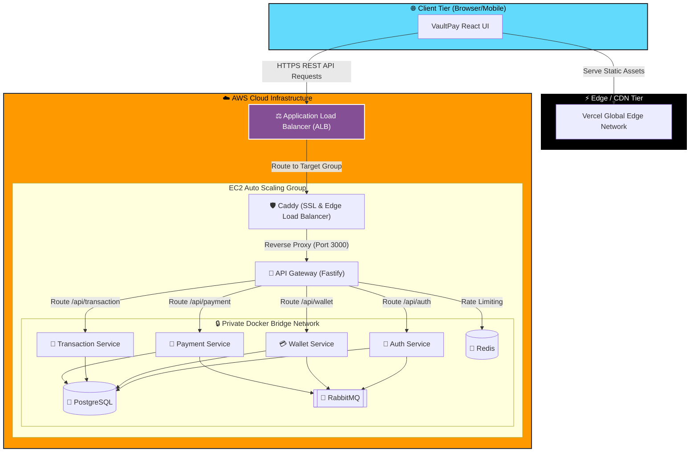
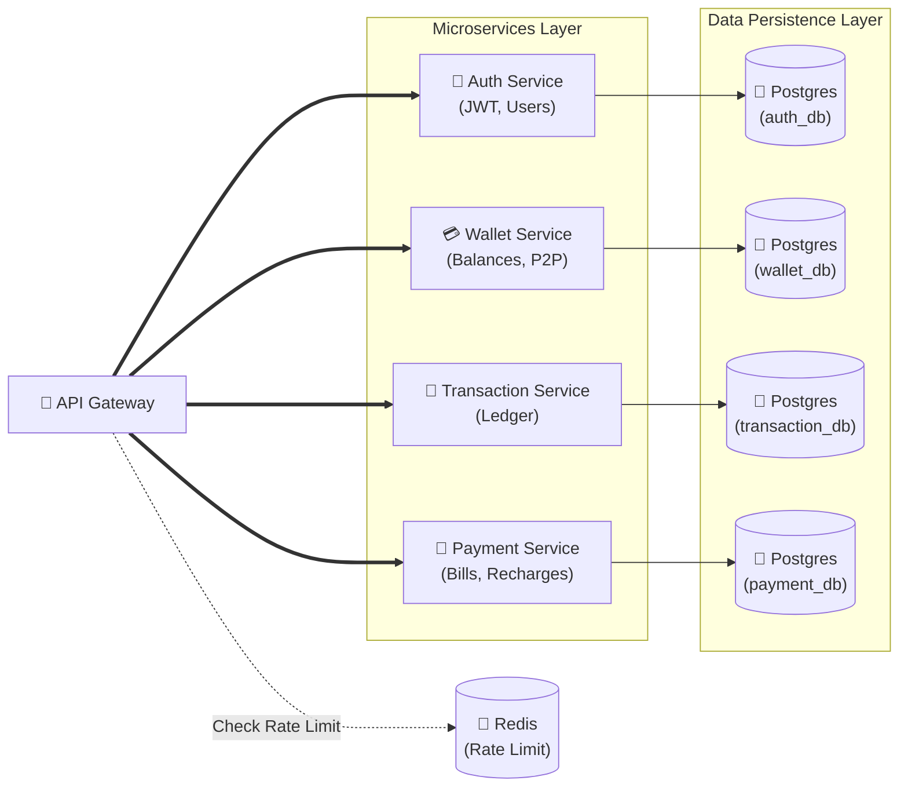
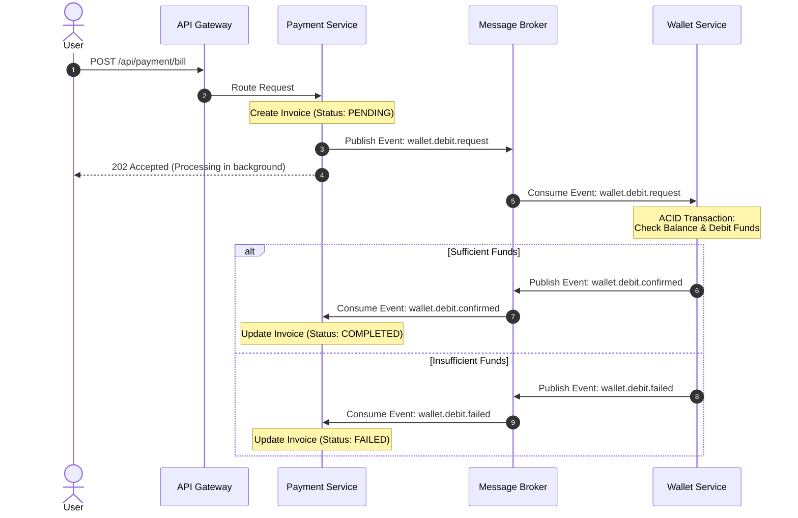

# VaultPay: FinTech Microservices Application

VaultPay is a highly scalable, event-driven digital wallet application built using a **Microservices Architecture**. It demonstrates modern backend patterns, particularly the **Choreography Saga Pattern** for distributed transactions, ensuring high availability, zero-downtime deployments, and robust data consistency across decoupled services.

This project was built from the ground up to showcase production-grade cloud architecture, DevOps automation, and resilient software design.

🌐 **Live Demo (Frontend):** [https://vaultpay-microservices.vercel.app](https://vaultpay-microservices.vercel.app)
⚙️ **Live API (Backend):** `https://18-218-110-14.nip.io/api`

---

## 🏗 Architecture & Tech Stack

### Core Technologies
- **Frontend:** React, Vite, TailwindCSS, Framer Motion
- **Backend Services:** Node.js, Fastify, TypeScript
- **Databases:** PostgreSQL (with Prisma ORM), Redis
- **Message Broker:** RabbitMQ
- **DevOps & Cloud:** AWS EC2, Docker & Docker Compose, GitHub Actions (CI/CD), Caddy (Reverse Proxy & Auto-SSL)

### 1. High-Level Full Stack Architecture
This diagram illustrates the macro-level system boundaries, showing how the Vercel-hosted React frontend securely communicates with the AWS-hosted backend cluster.



### 2. Low-Level Backend Microservices Architecture
At the micro-level, the backend isolates concerns. Each microservice connects to its own fully isolated database (`auth_db`, `wallet_db`, etc.) within the PostgreSQL instance to prevent tightly coupled monolithic data structures.



### 3. Event-Driven Distributed Transactions (Saga Pattern)
To eliminate synchronous HTTP bottlenecks and cascading failures, inter-service communication is handled asynchronously via RabbitMQ. This sequence diagram demonstrates the Choreography Saga for a bill payment.



---

## 🚀 Key Engineering Achievements

### 1. Event-Driven Architecture (Choreography Saga Pattern)
To prevent cascading failures and eliminate synchronous HTTP bottlenecks, inter-service communication is handled via **RabbitMQ**. 
When a user pays a bill, the system utilizes a Choreography Saga:
- **Payment Service** creates a `PENDING` payment and publishes a `wallet.debit.request` event.
- **Wallet Service** consumes the event, securely debits the user using an ACID transaction, and publishes a `wallet.debit.confirmed` event.
- **Payment Service** consumes the confirmation and marks the payment as `COMPLETED`.

### 2. Fully Automated CI/CD Pipeline (GitHub Actions)
The deployment process is entirely automated. Pushing code to the `main` branch triggers a GitHub Action that:
- SSHs into the AWS EC2 instance.
- Pulls the latest code.
- Rebuilds and restarts the 8 Docker containers sequentially with zero downtime.
- Prunes unused images to optimize server storage.

### 3. Production Cloud Deployment (AWS & Docker)
The entire infrastructure is containerized and hosted on a Linux AWS EC2 instance. 
- **Docker Compose** orchestrates the 5 microservices alongside Postgres, Redis, and RabbitMQ within an isolated virtual network.
- **Caddy** acts as an edge router, automatically intercepting traffic and provisioning free Let's Encrypt SSL/TLS certificates via `nip.io`, ensuring the backend API is fully served over secure `https://`.

---

## 🛠 Local Setup & Installation

Want to run this massive architecture on your own machine?

### Prerequisites
- Docker & Docker Compose
- Node.js (v18+)

### 1. Clone & Start Infrastructure
Start the entire backend stack (PostgreSQL, RabbitMQ, Redis, and all 5 Microservices) with a single command:
```bash
git clone https://github.com/MonishReddyDev/vaultpay-microservices.git
cd vaultpay-microservices/vaultpay-backend
docker-compose up -d --build
```

### 2. Start the Frontend
In a separate terminal, launch the React UI:
```bash
cd vaultpay-ui
npm install
npm run dev
```

---

## 👨‍💻 Author
**Monish Reddy**
A passionate Full-Stack Software Engineer specializing in scalable cloud architectures, microservices, and modern web development.

[](https://www.linkedin.com/in/monishreddy/)

*If you are reviewing this repository for an engineering role, please feel free to test the live demo, explore the CI/CD configuration in the `.github` folder, or examine the RabbitMQ event handlers in the microservice source code.*
